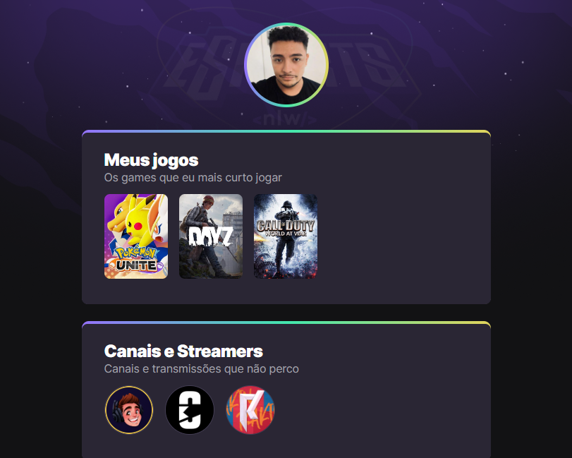

# NLW eSports - Trilha Explorer

> Projeto construido durante o evento da Next Level Week
da Rocketseat.

## Tecnologias

- HTML
- CSS
- GIT e GITHUB

## Desafios

Este foi o meu primeiro projeto feito com muito carinho na semana da NLW. Pela primeira vez tive a experiência de usar animações no CSS e fazer commits, durante o projeto, conseguir perceber a importância de ter uma estrutura legível e organizada para manutenção e alterações. Eu me divertir bastante nessa semana xD.

[Clique aqui para acessar](https://devjoaobatista.github.io/nlw-esports-explorer)

## Contato

dev.joaobatista@gmail.com